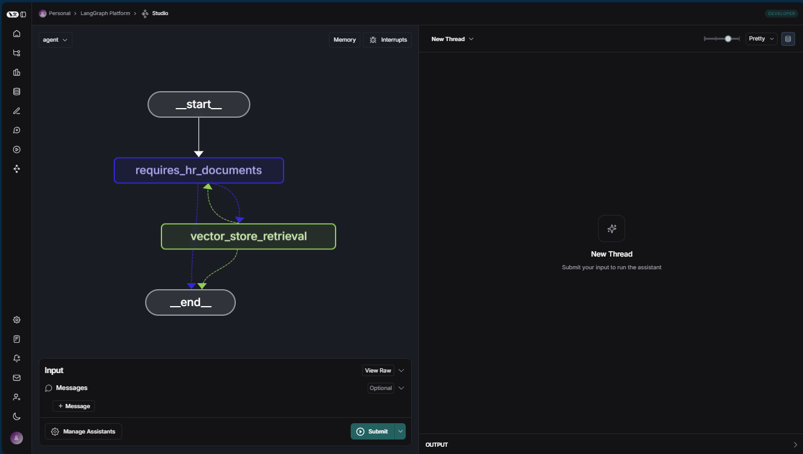

# Azure TypeScript LangChainJS Sample

This sample demonstrates how to build an intelligent agent using TypeScript, [LangChain.js](https://js.langchain.com/), [LangGraph](https://github.com/langchain-ai/langgraphjs), Azure OpenAI, and Azure AI Search to create a Retrieval Augmented Generation (RAG) application.

The sample includes an HR document query system that allows users to ask questions about employee benefits and company policies, with the agent retrieving relevant information from PDF documents.


## Features

- TypeScript-based LangChain.js implementation
- LangGraph agent architecture for dynamic orchestration of AI components
- Integration with Azure OpenAI for embeddings and completions
- Vector search with Azure AI Search
- FastAPI server for RESTful API access
- Docker support for containerized deployment
- Environment variable management
- PDF document processing and vector storage

## Repository Structure

The repository is organized as a monorepo with the following packages:

- **langgraph-agent**: Core agent implementation using LangGraph
- **server-api**: FastAPI server exposing the agent functionality

## Prerequisites

- [Node.js](https://nodejs.org/) (v18 or later)
- [npm](https://www.npmjs.com/)
- [Azure subscription](https://azure.microsoft.com/free/)
- Azure OpenAI service instance with deployed models
- Azure AI Search service instance

## Getting Started

### 1. Clone the repository

```bash
git clone https://github.com/Azure-Samples/azure-typescript-langchainjs.git
cd azure-typescript-langchainjs
```

### 2. Set up Azure resources

Create the following resources:

* Azure AI Search
* Azure OpenAI
    * LLM model for chat completion
    * Embedding model to get embeddings for PDF files
* Optional: Azure Container Apps
* Optional: Azure Container registry

### 3. Configure environment variables

Copy the sample environment file:

```bash
cp ./packages/langgraph-agent/sample.env ./packages/langgraph-agent/.env
```

Update the `.env` file with the values from your Azure resources:

```
# Embedding resource
AZURE_OPENAI_EMBEDDING_INSTANCE="<your-openai-resource-name>"
AZURE_OPENAI_EMBEDDING_KEY="<your-openai-key>"
AZURE_OPENAI_EMBEDDING_MODEL="text-embedding-ada-002"
AZURE_OPENAI_EMBEDDING_API_VERSION="2023-05-15"

# LLM resource
AZURE_OPENAI_COMPLETE_INSTANCE="<your-openai-resource-name>"
AZURE_OPENAI_COMPLETE_KEY="<your-openai-key>"
AZURE_OPENAI_COMPLETE_MODEL="gpt-35-turbo-instruct"
AZURE_OPENAI_COMPLETE_API_VERSION="2024-10-21"
AZURE_OPENAI_COMPLETE_MAX_TOKENS=1000

# Azure AI Search connection settings
AZURE_AISEARCH_ENDPOINT="https://<your-search-resource-name>.search.windows.net"
AZURE_AISEARCH_ADMIN_KEY="<your-search-admin-key>"
AZURE_AISEARCH_QUERY_KEY="<your-search-query-key>"
AZURE_AISEARCH_INDEX_NAME="northwind"

# Optional LangSmith configuration
LANGSMITH_TRACING=true
LANGSMITH_ENDPOINT="https://api.smith.langchain.com"
LANGSMITH_API_KEY="<your-langsmith-api-key>"
LANGSMITH_PROJECT="<your-langsmith-project-name>"
NORTHWIND_PDF_LOADED=false
```

### 4. Install dependencies

```bash
npm install
```

### 5. Load data into vector store

```bash
cd packages/langgraph-agent
npm run build
npm run load_data
```

### 6. Run the application

#### Run the API server

```bash
cd packages/server-api
npm run start
```

The server will be available at http://localhost:3000.

#### Run the LangGraph Studio (optional)

```bash
cd packages/langgraph-agent
npm run studio
```

This will start the LangGraph Studio interface where you can visualize and debug the agent's workflow.



## Docker Support

You can also run the application in a Docker container:

```bash
npm run build:docker
npm run start:docker
```

This will build a Docker image and run it, exposing the API server on port 3000.

## API Usage

The API server exposes the following endpoints:

- `GET /`: Health check endpoint
- `POST /answer`: Submit a question to the agent

Example request:

```bash
curl -X POST http://localhost:3000/answer \
  -H "Content-Type: application/json" \
  -d '{"question": "What are the standard benefit options?"}' 
```

## Example Questions

The agent can answer questions about the HR documents, such as:

1. "What are the standard benefit options?"
2. "Tell me about dental coverage in the Health Plus plan"
3. "What does the employee handbook say about vacation time?"

## License

This project is licensed under the ISC License - see the [LICENSE.md](LICENSE.md) file for details.

## Contributing

Please read [CONTRIBUTING.md](CONTRIBUTING.md) for details on our code of conduct and the process for submitting pull requests.
