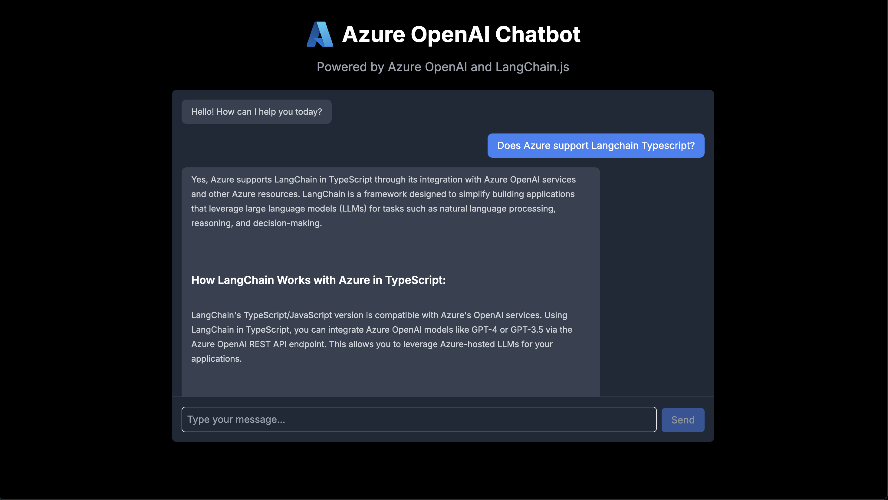

# Azure OpenAI Chatbot with TypeScript and LangChain.js



A modern, responsive chatbot application built with TypeScript, Next.js 15.2, and LangChain.js that leverages Azure OpenAI services. This project demonstrates best practices for building AI-powered applications with Microsoft Azure technologies.

## Features

This project provides the following features:

* Integration with Azure OpenAI services using LangChain.js
* Responsive chat interface built with Next.js 15.2 and React
* TypeScript for type safety and better developer experience
* Support for conversation history and context management
* Customizable prompt templates and chain configurations
* Comprehensive testing suite (unit, integration, and E2E tests)
* Environment configuration for different deployment scenarios

## Getting Started

### Prerequisites

- Node.js 18.x or higher
- An Azure account with access to Azure OpenAI services
- A deployed Azure OpenAI model

### Setting Up Azure OpenAI

You can set up Azure OpenAI in two ways:

#### Option 1: Direct Access to Azure OpenAI Service (Used in this project)

1. Create an Azure OpenAI resource in the Azure Portal
   - Navigate to Azure Portal → Create Resource → Search for "Azure OpenAI"
   - Configure your resource with appropriate resource group and region

2. Deploy an Azure OpenAI model
   - Navigate to your Azure OpenAI resource
   - Select "Model deployments" in the left navigation
   - Deploy a suitable model (e.g., GPT-4) and note the deployment name

3. Get your API credentials
   - Go to your Azure OpenAI resource and select "Keys and Endpoint"
   - Note your key and endpoint for the environment setup

#### Option 2: Using Azure AI Foundry (Alternative approach)

1. Create an Azure AI Foundry Hub in the Azure Portal
   - Navigate to Azure Portal → Create Resource → Search for "Azure AI Foundry"
   - Configure your Hub with appropriate resource group and region

2. Create a Project within your Hub
   - Launch Azure AI Foundry from your newly created Hub
   - Create a new project and give it a name

3. Connect or deploy Azure OpenAI models
   - Connect existing Azure OpenAI resources or deploy new models
   - Navigate to Models & Endpoints in your project
   - Deploy or connect to your preferred model (e.g., GPT-4o)

### Installation

1. Clone the repository
   ```bash
   git clone https://github.com/Azure-Samples/azure-typescript-langchainjs.git
   cd azure-typescript-langchainjs
   ```

2. Install dependencies
   ```bash
   npm install
   ```

3. Configure environment variables
   ```bash
   cp .env.example .env.local
   ```
   
   Then edit `.env.local` with your Azure OpenAI credentials:
   ```
   AZURE_OPENAI_API_KEY=your_api_key_here
   AZURE_OPENAI_ENDPOINT=https://your-resource-name.openai.azure.com
   AZURE_OPENAI_API_DEPLOYMENT_NAME=your_deployment_name
   AZURE_OPENAI_API_VERSION=2023-12-01-preview
   ```

   Note: If using Azure AI Foundry, you can retrieve these credentials from your AI Foundry project's connections.

### Quickstart

1. Start the development server
   ```bash
   npm run dev
   ```

2. Open your browser and navigate to `http://localhost:3000`

3. Start chatting with the Azure OpenAI-powered assistant!

## Project Structure

```
├── src/                     # Source code
│   ├── app/                 # Next.js app directory
│   │   ├── api/             # API routes
│   │   │   └── chat/        # Chat API endpoints
│   │   └── page.tsx         # Main page component
│   ├── components/          # React components
│   │   ├── ChatInput.tsx    # Chat input component
│   │   ├── ChatInterface.tsx # Main chat interface
│   │   ├── MessageList.tsx  # Message display component
│   │   └── ui/              # UI components
│   ├── lib/                 # Utility libraries
│   │   ├── azure/           # Azure integrations
│   │   │   └── azure-openai.ts # Azure OpenAI client
│   │   └── langchain/       # LangChain.js configurations
│   └── types/               # TypeScript type definitions
└── tests/                   # Test files
    ├── unit/                # Unit tests
    ├── integration/         # Integration tests
    └── e2e/                 # End-to-end tests
```

## Configuration

### Connecting to Azure OpenAI

This project uses the LangChain.js library with the Azure OpenAI integration. The configuration is handled in `src/lib/azure/azure-openai.ts`:

```typescript
import { ChatOpenAI } from '@langchain/openai';
import { AzureOpenAIInput } from '@langchain/openai/types';

export async function getAzureChatModel(): Promise<ChatOpenAI> {
  // Get environment variables
  const apiKey = process.env.AZURE_OPENAI_API_KEY;
  const endpoint = process.env.AZURE_OPENAI_ENDPOINT;
  const deploymentName = process.env.AZURE_OPENAI_API_DEPLOYMENT_NAME;
  const apiVersion = process.env.AZURE_OPENAI_API_VERSION || '2023-12-01-preview';

  // Validate environment variables
  if (!apiKey || !endpoint || !deploymentName) {
    throw new Error(
      'Missing required environment variables for Azure OpenAI.'
    );
  }

  // Create and return the Azure OpenAI model
  return new ChatOpenAI({
    temperature: 0.7,
    modelName: deploymentName,
    azure: {
      apiKey,
      endpoint,
      apiVersion,
      deploymentName,
    },
  });
}
```

## Azure AI Foundry Integration

While this project currently uses direct Azure OpenAI credentials, you can also integrate with Azure OpenAI through Azure AI Foundry:

1. Create connections to your Azure OpenAI resources in your Azure AI Foundry project
2. Retrieve the credentials from Azure AI Foundry portal
3. Use these credentials in the same way as shown in the configuration above

The Azure AI Foundry portal provides a centralized way to manage all your AI resources, including Azure OpenAI deployments.

## Testing

The project includes comprehensive testing:

```bash
# Run unit and integration tests
npm test

# Run tests in watch mode
npm run test:watch

# Run end-to-end tests
npm run test:e2e
```

## Deployment

This project can be deployed to Azure in several ways:

### Azure Static Web Apps

1. Create a new Static Web App in the Azure Portal
2. Connect to your GitHub repository
3. Configure the build settings as follows:
   - Build command: `npm run build`
   - Output location: `out`
4. Add your environment variables in the Azure Portal under Configuration → Application settings

### Azure App Service

1. Create a new App Service in the Azure Portal
2. Configure GitHub Actions for continuous deployment:
   - Create a `.github/workflows/azure-webapps-node.yml` file in your repository
   - Use the Azure Web App deployment template
3. Add the necessary environment variables in the Azure Portal

## Contributing

Please refer to [CONTRIBUTING.md](./CONTRIBUTING.md) for details on our code of conduct and the process for submitting pull requests.

## Resources

- [Azure OpenAI Service Documentation](https://learn.microsoft.com/en-us/azure/cognitive-services/openai/)
- [Azure AI Foundry Documentation](https://learn.microsoft.com/en-us/azure/ai-foundry/)
- [Azure OpenAI in Azure AI Foundry](https://learn.microsoft.com/en-us/azure/ai-studio/azure-openai-in-ai-studio)
- [LangChain.js Documentation](https://js.langchain.com/docs/)
- [LangChain.js Azure OpenAI Integration](https://js.langchain.com/docs/integrations/chat/azure/)
- [Next.js 15.2 Documentation](https://nextjs.org/docs)
- [TypeScript Documentation](https://www.typescriptlang.org/docs/)
- [Azure Static Web Apps Documentation](https://docs.microsoft.com/en-us/azure/static-web-apps/)
- [Azure App Service Documentation](https://docs.microsoft.com/en-us/azure/app-service/)