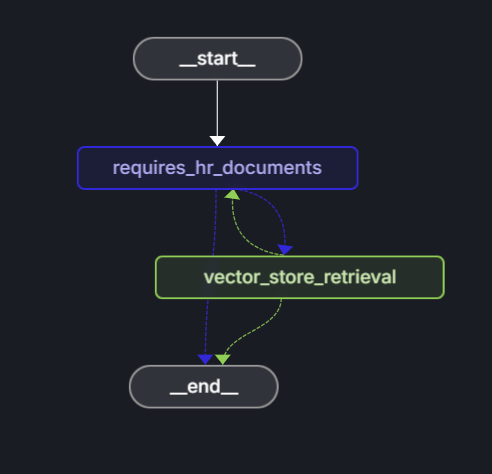

# Intelligent documentation search with LangChainjs and Azure AI Search

Use LangChainjs, as an AI framework to quickly create an AI agent which allows a _NorthWind_ company employee to ask human resources related questions. NorthWind has two data sources it pulls from: HR documentation internally available to all employees, and an HR database that is secured to HR. Let's build an agent to determine if the employee's question can be answered by the internally public documents. If the question can be answered from these documents, provide the answer. 



## Agent architecture

The LangChainjs framework provides the decision flow for the agent. In LangChain.js the graph is an orchestration structure that connects various nodes (like agents, tools, and processing steps) to form a workflow. The agent is one such node that makes decisions and generates responses based on inputs and available tools. Essentially, the graph manages the flow and state transitions between nodes (including multiple invocations of the agent), while the agent handles the logic for interacting with language models and optionally its tools. The agent is a LangChainjs graph which integrates with Azure AI Search and Azure OpenAI. Much of the work of integrating to the Azure services has been abstracted away so you just need to set configurations for the Azure services, organize the workflow, and provide any business logic. 

The Azure service integration includes: 
* The Azure AI Search is used to provide a vector store for the HR documents. The document embeddings are created with an embeddings model from Azure OpenAI, such as `text-embedding-ada-002`, and inserted into the vector store using the _admin key_ for Azure AI Search.  
* The Azure OpenAI service is used as the large language model (LLM) such as `gpt-35-turbo-instruct` to be able to answer employee questions. It is also used to determine if the question is generally HR related so that the documents are relevant. 

|Question|Relevance to HR documents|
|--|--|
|`Does the NorthWind Health plus plan cover eye exams?`|This question is relevant to HR and general enough that the HR documents such as the employee handbook, the benefits handbook, and the employee role library should be able to answer it.|
|`How much of my perks + benefit have I spent`|This question isn't relevant to the general HR documents. This question should be sent to an agent which has access to employee data. |

## Prerequisities

* Node.js LTS
* TypeScript
* LangChain.js and a LangSmith project name, its key, and its endpoint. 
* Azure AI resource: the resource endpoint, the admin key to insert the documents, the query key to read the documents, and the index name. 
* Azure OpenAI resource: the resource instance name, the key, and 2 models and their API versions. An API version is not the same thing as a model version.
    * Embeddings model such as `text-embedding-ada-002` and its API version.
    * Large language model such as `gpt-35-turbo-instruct` and its API version. 
* Create a .env for local development with the to hold this information. 

    ```dotenv
    # Embedding resource
    AZURE_OPENAI_EMBEDDING_INSTANCE="<RESOURCE_INSTANCE_NAME>"
    AZURE_OPENAI_EMBEDDING_KEY=""
    AZURE_OPENAI_EMBEDDING_MODEL="text-embedding-ada-002"
    AZURE_OPENAI_EMBEDDING_API_VERSION="2023-05-15"
    
    ## LLM resource
    AZURE_OPENAI_COMPLETE_INSTANCE="<RESOURCE_INSTANCE_NAME>"
    AZURE_OPENAI_COMPLETE_KEY=""
    AZURE_OPENAI_COMPLETE_MODEL="gpt-35-turbo-instruct"
    AZURE_OPENAI_COMPLETE_API_VERSION="2024-10-21"
    AZURE_OPENAI_COMPLETE_MAX_TOKENS=1000
    
    # Azure AI Search connection settings
    AZURE_AISEARCH_ENDPOINT="https://<RESOURCE_INSTANCE_NAME>.search.windows.net"
    AZURE_AISEARCH_ADMIN_KEY=""
    AZURE_AISEARCH_QUERY_KEY=""
    AZURE_AISEARCH_INDEX_NAME="northwind"
    
    LANGSMITH_TRACING=true
    LANGSMITH_ENDPOINT="https://api.smith.langchain.com"
    LANGSMITH_API_KEY="lsv2_pt..."
    LANGSMITH_PROJECT=""
    NORTHWIND_PDF_LOADED=true
    ```

## Initialize your Node.js project

In a new directory, initialize your Node.js project for your esm TypeScript agent. 

```console
npm init -y
npm pkg set type=module
tsc init -y
```

## Install dependencies

1. Install the following Azure dependencies to use Azure AI Search.
    
    ```console
    npm install @azure/search-documents 
    ```

1. Install the following LangChain.js dependencies to create and use an agent.

    ```console
    npm install @langchain/community @langchain/core @langchain/langgraph @langchain/openai langchain
    ```

1. Install the following into your devDependencies to use with local development.

    ```console
    npm install --save-dev dotenv
    ```
    
## Azure resource configuration files

Because there are several resources and two models in the same Azure OpenAI resource instance, use a specific configuration file for each resource. 

The Azure AI Search configuration file to use the admin key to insert documents:

```typescript
// ./src/config/vector_store_admin.ts

const endpoint = process.env.AZURE_AISEARCH_ENDPOINT;
const adminKey = process.env.AZURE_AISEARCH_ADMIN_KEY;
const indexName = process.env.AZURE_AISEARCH_INDEX_NAME;

export const VECTOR_STORE_ADMIN = {
  endpoint,
  key: adminKey,
  indexName,
};
```

Create other configuration files to manage the separate resources:

* [embeddings.ts](src/config/embeddings.ts)
* [llm.ts](src/config/llm.ts)
* [vector_store_query.ts](src/config/vector_store_query.ts)

Create files to hold constants: 

* [system_prompt.ts](src/config/system_prompt.ts)
* [nodes.ts: define LangChain.js graph nodes](src/config/nodes.ts)
* [user_queries.ts: example user queries](src/config.ts)

## Load documents into Azure AI Search

Use LangChain.js to load the [PDF documents]() into Azure AI Search. The LangChain.js orchestration makes it easy to create an Azure AI Search client and load the documents from the _data_ directory into AI Search for the vector store. 

```typescript
// src/scripts/loadVectorStore.ts

import { loadPdfsFromDirectory } from "../azure/find_pdfs.js";
import { updateEnv } from "../utils/update_env.js";
import { getEmbeddingClient } from "../azure/embeddings.js";
import { fileURLToPath } from "url";
import path from "path";

const __filename = fileURLToPath(import.meta.url);
const __dirname = path.dirname(__filename);

const NORTHWIND_PDF_DIRECTORY = "../data";

async function loadData(embeddings: any): Promise<void> {
  let dataLoaded = process.env.NORTHWIND_PDF_LOADED;

  if (!dataLoaded || dataLoaded === "true") {
    const dirPath = path.join(__dirname, NORTHWIND_PDF_DIRECTORY);
    await loadPdfsFromDirectory(embeddings, dirPath);
    await updateEnv("NORTHWIND_PDF_LOADED", "true");
  }
}

export async function main() {
  const embeddings = getEmbeddingClient();
  await loadData(embeddings);
}

main()
  .then(() => {
    console.log("Load vector store complete");
  })
  .catch(console.error);
```


## Hosting

- Functions runtime limited for max runtime - durable ?
- Better suited for container apps

## Evaluations

- Yohan - Langchain not great at evaluations
- Yohan uses https://www.promptfoo.dev/

## Tracing

- Yohan - LangChain - env variable to see all traces - debug flag to see all traces - 
- Yohan - Extend your own traces - to Azure OpenTelemetry - 

## LangChain and LangGraph integration

### AI Search vector store

LangChain community class is AzureAISearchVectorStore. 

From methods:
* fromDocuments
* fromTexts

To methods:
* toJSON
* toJSONNotImplemented

Add and delete methods:
* addDocuments
* addVectors
* delete

Retreiver methods:
* asRetriever

Search methods:

* **similaritySearch** - *** - showcase different options - semantic ranker with hybrid search


* maxMarginalRelevanceSearch - *** - built in reranking - not recommended for AI Search - there for compatibility with other integration
* hybridSearchVectorWithScore
* semanticHybridSearchVectorWithScore
* similaritySearchVectorWithScore
* similaritySearchWithScore

Yohan - PDF loader 3rd data - 
schema - open discussion - use specific keys for content and metadata - abstraction with default schema - uses smart default for content - 

if you had geographic data and wanted to index it differently
or metadata that you wanted to search these extra fields


#### Load unstructured documents into Azure Search AI with default schema

[Load documents from file](https://js.langchain.com/docs/integrations/vectorstores/azure_aisearch/)

```javascript
// Load documents from file
const loader = new TextLoader("./state_of_the_union.txt");
const rawDocuments = await loader.load();
const splitter = new RecursiveCharacterTextSplitter({
  chunkSize: 1000,
  chunkOverlap: 0,
});
const documents = await splitter.splitDocuments(rawDocuments);

// Create Azure AI Search vector store
const store = await AzureAISearchVectorStore.fromDocuments(
  documents,
  new OpenAIEmbeddings(),
  {
    search: {
      type: AzureAISearchQueryType.SimilarityHybrid,
    },
  }
);
```

#### Similarty search

[Similarity search](https://js.langchain.com/docs/integrations/vectorstores/azure_aisearch/)

```javascript
// Performs a similarity search
const resultDocuments = await store.similaritySearch(
  "What did the president say about Ketanji Brown Jackson?"
);

console.log("Similarity search results:");
console.log(resultDocuments[0].pageContent);
```

#### Use vector store as retriever

```javascript
const countOfDocuments = 1
const retriever = store.asRetriever(countOfDocuments);

// Retrieve the most similar text
const retrievedDocuments = await retriever.invoke("What is LangChain?");

retrievedDocuments[0].pageContent;
```


#### Use vector store as part of chain

[Use in chain](https://js.langchain.com/docs/integrations/vectorstores/azure_aisearch/)

```javascript
const llm = new AzureOpenAI({ 
    model: "gpt-3.5-turbo-1106",
    azureOpenAIApiKey: "<your_key>", // In Node.js defaults to process.env.AZURE_OPENAI_API_KEY
    azureOpenAIApiInstanceName: "<your_instance_name>", // In Node.js defaults to process.env.AZURE_OPENAI_EMBEDDING_INSTANCE
    azureOpenAIApiDeploymentName: "<your_deployment_name>", // In Node.js defaults to process.env.AZURE_OPENAI_API_DEPLOYMENT_NAME
    azureOpenAIApiVersion: "<api_version>", // In Node.js defaults to process.env.AZURE_OPENAI_API_VERSION
    temperature: 0,
    maxTokens: undefined,
    timeout: undefined,
    maxRetries: 2
});
const questionAnsweringPrompt = ChatPromptTemplate.fromMessages([
  [
    "system",
    "Answer the user's questions based on the below context:\n\n{context}",
  ],
  ["human", "{input}"],
]);

const combineDocsChain = await createStuffDocumentsChain({
  llm,
  prompt: questionAnsweringPrompt,
});

// Azure AI Search as retriever
const chain = await createRetrievalChain({
  retriever: store.asRetriever(),
  combineDocsChain,
});

const response = await chain.invoke({
  input: "What is the president's top priority regarding prices?",
});

console.log("Chain response:");
console.log(response.answer);
```

#### Tool to query Azure AI Search vector store

Tool

```javascript
import { Tool } from "langchain/tools"; 
import { AzureAISearchVectorStore } from "langchain/vectorstores/azure_aisearch";
import { OpenAIEmbeddings } from "langchain/embeddings/openai";

// Assume that you have already loaded your documents and created your vector store.
// For example, you might have created your vector store like this:
// const documents = await splitter.splitDocuments(rawDocuments);
// const store = await AzureAISearchVectorStore.fromDocuments(
//   documents,
//   new OpenAIEmbeddings(),
//   { search: { type: "SimilarityHybrid" } }
// );

// If your store is created elsewhere, import or pass it in.
let store; // This should be your initialized AzureAISearchVectorStore

/**
 * Function that queries the vector store and returns concatenated page content of retrieved documents.
 * @param {string} query - User query to search within the vector store.
 * @returns {Promise<string>} - Combined page content of matched documents.
 */
export async function queryVectorStore(query) {
  if (!store) {
    throw new Error("Vector store is not initialized.");
  }
  // Create a retriever from the vector store, you can pass parameters (e.g., number of documents)
  const retriever = store.asRetriever({ count: 3 });
  const retrievedDocuments = await retriever.invoke(query);
  // For simplicity, join the page content of returned documents
  return retrievedDocuments.map(doc => doc.pageContent).join("\n---\n");
}

// Wrap the function as a LangChain Tool so that it can be used as part of an agent's graph.
export const vectorStoreTool = new Tool({
  name: "VectorStoreQuery",
  description:
    "Searches the Azure AI Search vector store for relevant context based on the user input.",
  func: queryVectorStore,
});
```

Call tool in an agent

```javascript
import { AgentExecutor } from "langchain/agents";
import { vectorStoreTool } from "./vectorStoreTool";
import { AzureOpenAI } from "langchain/llms/azure_openai";

// Instantiate your LLM (with proper environment variable configuration)
const llm = new AzureOpenAI({
  model: "gpt-3.5-turbo-1106",
  azureOpenAIApiKey: process.env.AZURE_OPENAI_API_KEY,
  azureOpenAIApiInstanceName: process.env.AZURE_OPENAI_EMBEDDING_INSTANCE,
  azureOpenAIApiDeploymentName: process.env.AZURE_OPENAI_API_DEPLOYMENT_NAME,
  azureOpenAIApiVersion: process.env.AZURE_OPENAI_API_VERSION,
  maxRetries: 2,
  temperature: 0,
});

// Create an agent with the vectorStoreTool (and any other tools you have).
const tools = [vectorStoreTool /*, ...other tools */];

// Create the agent executor graph.
const agentExecutor = AgentExecutor.fromLLMAndTools(llm, tools);

// Now use the agent to handle a query.
const response = await agentExecutor.invoke({
  input: "What does LangChain do?",
});

console.log("Agent response:", response);
```

### Azure OpenAI

LangChain class is [AzureOpenAI](https://v03.api.js.langchain.com/classes/_langchain_openai.AzureOpenAI.html#metadata). 

- asTool
- invoke
- withStructuredOutput?
- isRunnable
- assign
- batch
- bind
- call
- completionWithRetry
- generate
- generatePrompt
- getGraph
- getName
- getNumTokens
- identifyingParams
- invocationParams
- map
- pick
- pipe
- predict
- predictMessages
- serialize
- stream
- streamEvents
- streamLog
- toJSON
- toJSONNotImplemented
- transform
- withConfig
- withFallbacks
- withListeners
- withRetry
- withStructuredOutput?
- deserialize
- isRunnable


#### Use Azure OpenAI deployment model to get completion

````javascript
const llm = new AzureOpenAI({ 
    model: "gpt-3.5-turbo-1106",
    azureOpenAIApiKey: "<your_key>", // In Node.js defaults to process.env.AZURE_OPENAI_API_KEY
    azureOpenAIApiInstanceName: "<your_instance_name>", // In Node.js defaults to process.env.AZURE_OPENAI_EMBEDDING_INSTANCE
    azureOpenAIApiDeploymentName: "<your_deployment_name>", // In Node.js defaults to process.env.AZURE_OPENAI_API_DEPLOYMENT_NAME
    azureOpenAIApiVersion: "<api_version>", // In Node.js defaults to process.env.AZURE_OPENAI_API_VERSION
    temperature: 0,
    maxTokens: undefined,
    timeout: undefined,
    maxRetries: 2
});

const inputText = "AzureOpenAI is an AI company that ";

const completion = await llm.invoke(inputText);
completion;
````

#### Chaining

```javascript
import { PromptTemplate } from "@langchain/core/prompts";

const prompt = new PromptTemplate({
  template: "How to say {input} in {output_language}:\n",
  inputVariables: ["input", "output_language"],
});

const chain = prompt.pipe(llm);
await chain.invoke({
  output_language: "German",
  input: "I love programming.",
});
```

#### Evaluations with Foundry

#### Tracing with Foundry

